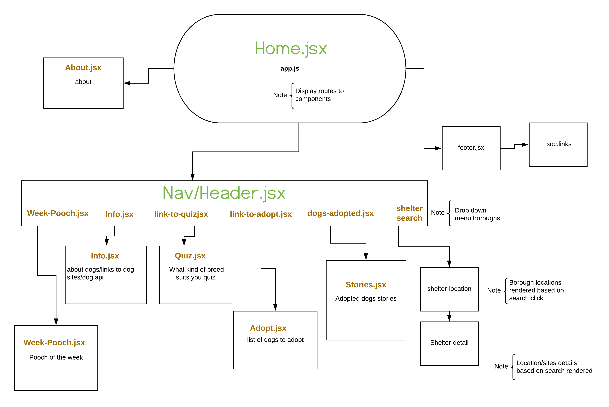
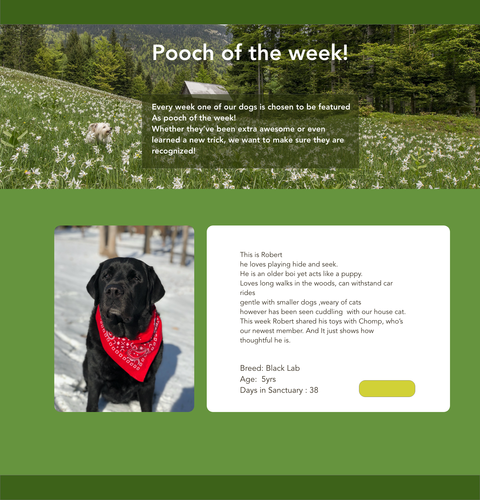
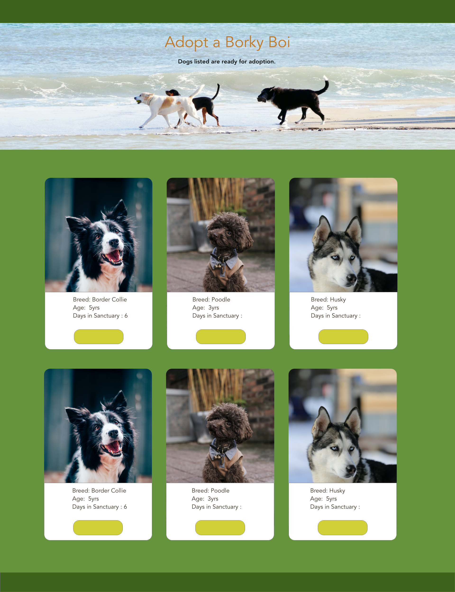

# borky-bois-sanctuary

#### A dog sanctuary website mockup . 
For a while I have loved the idea of havin a sanctuary for dogs, and while I'm not there **yet* I thought this would be a fun project for me to delve in. 

So I layed out the Component Hierarchy :

>
This web app will be made using React with a Rails backend.
>

####This will be  the landing/home page

>
Will feature Pooch of the week 

>
####A list of Dogs ready to be adopted who've been in the sanctuary 

>

####When you click on one of the dog images  there will be a pop window showing more information 

