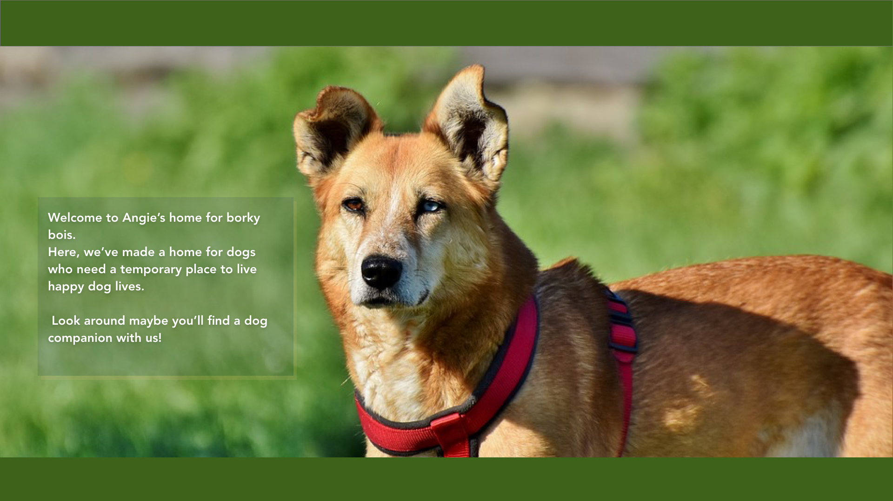

# borky-bois-sanctuary

### A dog sanctuary website mockup . 
For a while I have loved the idea of havin a sanctuary for dogs, and while I'm not there *yet* I thought this would be a fun project for me to delve in. 

### So I layed out the Component Hierarchy:

### This web app will be made using React with a Rails backend.
>
####  MVP Objectives:
- React front end/Rails back end with dog data and pooch of the week data
- An application for for dog adoption
>
#### Post  MVP Objectives:
- An option to sign up for a newsletter
- Volunteer page with application from.
- Dog api for breed information
- Short Quiz for those who are wondering what kind of dog breed is suitable for them
>

### This will be the landing/home page:

### Will also feature Pooch of the week:

### A list of Dogs ready to be adopted who've been in the sanctuary:

### When you click on one of the dog images  there will be a pop window showing more information:

>
-->
